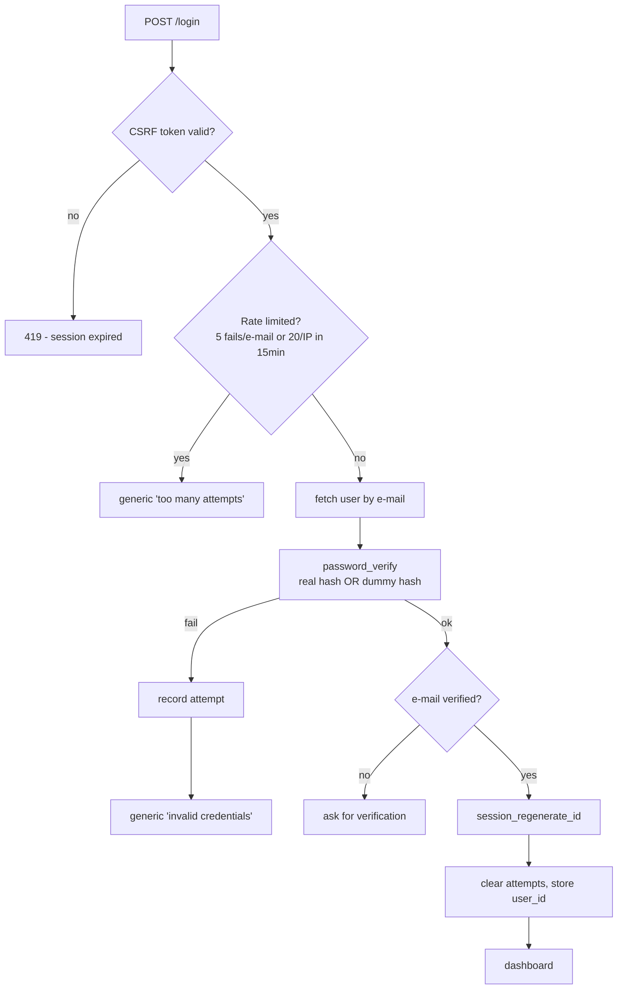

> **[Português](README.md)** | English

<div align="center">

# Fluxo

**Multi-user personal finance manager in vanilla PHP — with the entire authentication stack built from scratch, from password hashing to token rotation.**

[](https://www.php.net/)
[](#tests)
[](https://www.php-fig.org/psr/psr-12/)
[](#configuration)
[](LICENSE)

**177 tests** &bull; **0 frameworks** &bull; **100% prepared statements** &bull; **31 routes** &bull; **bcrypt + CSRF + rate limit + rotating tokens**

</div>

---

## Table of Contents

- [Why no framework?](#why-no-framework)
- [How it works](#how-it-works)
- [Authentication security](#authentication-security)
- [Features](#features)
- [Architecture](#architecture)
- [Running it](#running-it)
- [Tests](#tests)
- [Configuration](#configuration)
- [Roadmap](#roadmap)

## Why no framework?

Frameworks ship authentication ready-made — hiding exactly what this project sets out to demonstrate: **that I can build every security layer by hand**.

| | Laravel (Breeze/Fortify) | This project |
|---|---|---|
| **Password hashing** | Built-in, invisible | Explicit `password_hash()`/`password_verify()`, with a dummy hash against timing attacks |
| **Secure session** | Default config | `session_regenerate_id`, `use_strict_mode`, `HttpOnly/SameSite/Secure` cookies — every flag justified in code |
| **CSRF** | Magic middleware | Per-session token, `hash_equals`, a 15-line middleware you can read whole |
| **Rate limiting** | `ThrottleRequests` | `login_attempts` table with a 15-min window, separate limits per e-mail (5) and IP (20) |
| **"Remember me"** | `remember_token` cookie | Selector + hashed validator, **single-use with rotation** and theft detection |
| **Validation** | Rule strings | A `Validator` class with every regex documented piece by piece |
| **ORM** | Eloquent | Raw PDO with prepared statements — the SQL is visible, the `user_id` scoping is visible |
| **Reading cost** | Thousands of vendor files | The whole `src/` fits in an afternoon of code review |

The trade-off is real: for a commercial product, Laravel ships faster with less room for self-inflicted error. Here the goal is the opposite — expose the fundamentals.

## How it works

Every request enters through a single front controller and flows down the layers — each with exactly one job:

```mermaid
flowchart TB
    subgraph HTTP ["HTTP layer"]
        A[public/index.php<br/>front controller] --> B[Router]
        B --> C{Middleware}
        C -->|no session| L[redirect /login]
        C -->|no CSRF token| E419[419 page]
    end
    subgraph APP ["Application layer"]
        C -->|ok| D[Controller]
        D --> V[Validator<br/>regex + ownership]
        D --> S[Services<br/>Auth, RateLimiter, Tokens, Reports]
    end
    subgraph DATA ["Data layer"]
        S --> R[Repositories<br/>PDO prepared statements]
        V --> R
        R --> DB[(SQLite / MySQL<br/>every table scoped by user_id)]
    end
    D --> W[View<br/>output escaped via e&#40;&#41;]
    style HTTP fill:#1a1a2e,stroke:#e94560,color:#eee
    style APP fill:#16213e,stroke:#0f3460,color:#eee
    style DATA fill:#0f3460,stroke:#533483,color:#eee
```



## Authentication security

The core of the project. Every mechanism below has automated tests covering the happy path **and** the attack path.

### The login flow



### Passwords

- `password_hash()` with bcrypt — **never** plaintext, never homegrown crypto. Verification only via `password_verify()`.
- Unknown e-mail? Login still runs `password_verify` against a **dummy hash** — both paths cost one bcrypt, so response timing reveals nothing about which e-mails exist.
- Error message is **always generic** ("Invalid credentials") for wrong password and unknown e-mail alike.
- Input capped at 72 bytes — bcrypt silently ignores anything beyond that.

### Regex validation (format, not security)

Regex validates **shape**; security comes from hashing, rate limiting and prepared statements. Every pattern is documented in `src/Core/Validator.php`:

| Field | Pattern | Guarantees | Does not guarantee |
|---|---|---|---|
| Password | `^(?=.*[a-z])(?=.*[A-Z])(?=.*\d)(?=.*[^\w\s]).{8,}$` | 4 lookaheads: lowercase, uppercase, digit, special; min 8 | Real strength — `Senha@123` passes and is dictionary-weak |
| E-mail | `^[^\s@]+@[^\s@]+\.[^\s@]+$` + `filter_var` | `x@y.z` structure; `filter_var` is the source of truth | A fully RFC 5322 regex is unmaintainable and rejects real addresses — on purpose |
| Name | `^[\p{L}\p{M}' -]{2,60}$` (`/u`) | Unicode letters, accents, D'Angelo, Maria-Clara | XSS prevention — output escaping does that job |
| Amount | `^\d{1,3}(\.\d{3})*(,\d{2})?$` (BR format) | Parses into integer cents — money never becomes a float | — |

### Session and CSRF

- `session_regenerate_id(true)` on every login — kills session fixation.
- `session.use_strict_mode` — the server rejects session IDs it didn't generate.
- `HttpOnly` + `SameSite=Lax` cookies (+ `Secure` in production).
- A 256-bit CSRF token per session on every form; `hash_equals` comparison; POST without a token → **419**, the handler never runs.

### Brute force

- Attempts recorded per **e-mail and IP**; temporary lockout at 5 fails/e-mail or 20/IP within 15 minutes.
- The IP cap is deliberately higher: one office NAT must not lock out every user behind it.
- A successful login clears the counter; expired attempts are purged.

### Tokens (remember-me, reset, verification)

- All carry **256 bits of randomness** and are stored **only as hashes** — a database dump hands out zero working tokens.
- sha256, not bcrypt — and the code explains why: slow hashing only makes sense for low-entropy secrets (passwords); a 256-bit random token is not brute-forceable.
- **Remember-me**: a `selector:validator` cookie. The selector is an indexed lookup key; the validator is the secret. **Single-use with rotation** — every use consumes the token and issues a fresh one; a stolen cookie dies at the first use on either side. Valid selector + wrong validator = likely theft → **all** of that user's tokens are revoked.
- **Password reset**: 60-minute expiry, single-use, and it revokes the user's remember-me tokens (a password change kills persistent logins). Identical response for known and unknown e-mails.
- **E-mail verification**: required before first login; 24-hour token.

### Multi-user isolation

- **Every** repository query requires a `user_id` — isolation lives in the data layer, not just in controllers. Tested with two real users: cross-user find/update/delete all fail.
- Another user's category/account IDs in a form fail **exactly** like nonexistent IDs.

### Extra defenses

- Output escaping on 100% of HTML via `e()` (`htmlspecialchars` with `ENT_QUOTES`).
- CSV export with a **formula injection** guard — cells starting with `=` `+` `-` `@` get an apostrophe before they ever reach Excel.
- Chart.js from a CDN with **Subresource Integrity** — a compromised CDN breaks instead of executing.
- `X-Frame-Options: DENY`, `X-Content-Type-Options: nosniff`, `Referrer-Policy` headers.
- Errors: stack traces **never** reach the user; full log in `storage/app.log`, a friendly 500 page that doesn't depend on the renderer.

## Features

- **Transactions** — CRUD with amounts in cents, validated dates, type derived from the category (mismatch impossible by construction)
- **Categories and accounts** — per-user CRUDs; deletion blocked by `ON DELETE RESTRICT` while in use
- **Dashboard** — balance, month income × expenses, expenses-by-category chart, ceilings and goals with progress bars
- **Monthly report** — per-category summary with a month picker
- **Spending ceilings** — monthly limit per expense category with upsert and over-limit alert
- **Income goals** — monthly target per income category with upsert, amount left and a reached highlight
- **Filters and search** — period, category, type, text (escaped `LIKE`), whitelist-based sorting, pagination
- **CSV export** — honoring active filters; BOM + semicolons (opens correctly in pt-BR Excel)

## Architecture

Layered MVC, no magic — `Controllers → Services/Validator → Repositories → PDO`. Authentication isolated in a service + middleware, never spread around.

```
public/          → index.php (only exposed PHP), assets, .htaccess
src/
  Core/          → Router, Database, Request, Response, Session,
                   Csrf, Validator, View, Middleware, Migrator, ErrorHandler
  Controllers/   → Auth, Registration, PasswordReset, Transaction,
                   Category, Account, Planning, Ceiling, IncomeGoal,
                   Dashboard, Report
  Services/      → AuthService, LoginRateLimiter, RememberMeService,
                   PasswordResetService, EmailVerificationService,
                   ReportService, Tokens, Mailer (interface + LogMailer)
  Repositories/  → one per aggregate, every method requires user_id
  Models/        → readonly entities + value objects (Money) + enums
  Views/         → PHP templates with mandatory output escaping
database/        → versioned SQL migrations + idempotent runner + seed
tests/           → Unit/ (pure functions) + Integration/ (in-memory SQLite)
docker/          → entrypoint (migrates + seeds on boot)
```

Decisions worth highlighting:

- **Money as integer cents** — floats on money are a bug waiting for a date; `Money` parses the Brazilian format and formats back with integer-only arithmetic.
- **Parse, don't validate** — input becomes a value object (`Money`, `TransactionFilter`) or `null`; never a "probably fine" string traveling through the system.
- **Native enums** (`CategoryType`, `LoginResult`) — invalid state doesn't compile, no stringly-typing.
- **Constraints in the database** — deliberate UNIQUEs and FKs with `RESTRICT`/`CASCADE`; the app translates violations into friendly messages instead of check-then-insert (no TOCTOU).

## Running it

Prerequisites: PHP 8.2+ and Composer — or just Docker.

```bash
git clone <repo> && cd <repo>
composer install
cp .env.example .env
composer migrate
composer seed
composer serve        # http://localhost:8000
```

With Docker:

```bash
docker compose up --build   # http://localhost:8000
```

Test user (created by the seed): **`teste@exemplo.com`** / **`Senha@123`**

There is no SMTP in dev: verification and reset e-mails land in **`storage/mail.log`** — open the file and follow the link.

## Tests

```bash
composer test    # 177 PHPUnit tests (unit + integration on in-memory SQLite)
composer lint    # PSR-12 via phpcs
composer check   # both
```

Coverage mirrors the project's core: password strength case by case, hash/verify, lockout by attempts (e-mail and IP separately), remember-me rotation and theft handling, reset expiry, cross-user isolation in every repository, broken-migration rollback, XSS escaping of the `e()` helper and the CSV formula-injection guard. All phases were built test-first (red → green).

## Configuration

<details>
<summary><strong>.env reference</strong></summary>

| Variable | Default | Description |
|---|---|---|
| `APP_ENV` | `dev` | `prod` turns on the `Secure` cookie flag |
| `APP_DEBUG` | `true` | `true` shows stack traces; in prod, **always** `false` |
| `APP_URL` | `http://localhost:8000` | Base for e-mailed links |
| `DB_DRIVER` | `sqlite` | `sqlite` or `mysql` |
| `DB_SQLITE_PATH` | `database/app.sqlite` | SQLite file path |
| `DB_HOST/PORT/NAME/USER/PASS` | — | Only used with `DB_DRIVER=mysql` |
| `SESSION_NAME` | `finance_session` | Session cookie name |

</details>

## Roadmap

- CI (GitHub Actions running `composer check` on every push)
- MySQL-dialect migrations (the connection layer already supports it; migration SQL is SQLite)
- Content-Security-Policy with a nonce for the chart script
- Argon2id once the PHP build ships libargon2
- Idle session timeout
- Dashboard and auth screenshots/GIF
- Account deletion (LGPD) — the schema's cascades already guarantee it

## License

[MIT](LICENSE)
