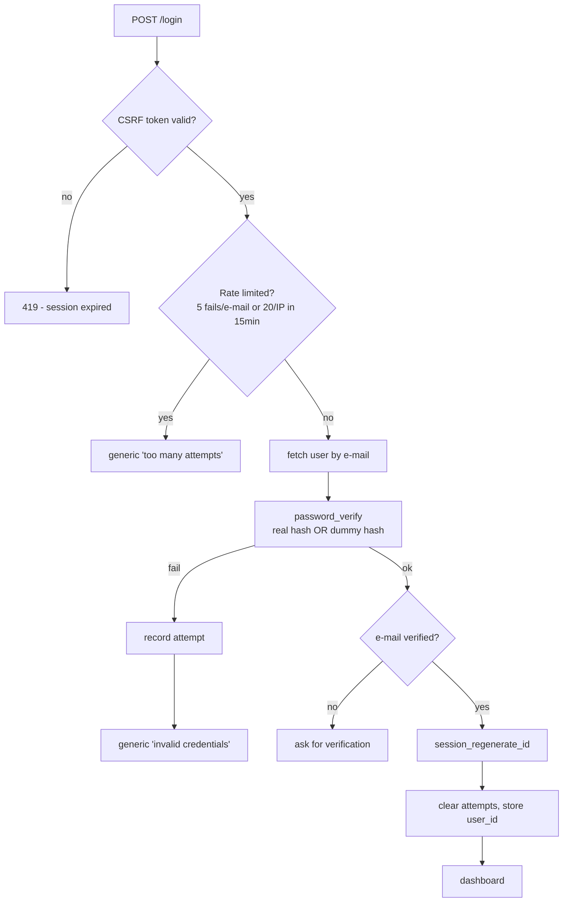

> Português | **[English](README.en.md)**

<div align="center">

# Fluxo

**Gestor de finanças pessoais multiusuário em PHP puro — com a autenticação inteira implementada do zero, do hash da senha à rotação de token.**

[](https://www.php.net/)
[](#testes)
[](https://www.php-fig.org/psr/psr-12/)
[](#configuração)
[](LICENSE)

**177 testes** &bull; **0 frameworks** &bull; **100% prepared statements** &bull; **31 rotas** &bull; **bcrypt + CSRF + rate limit + tokens rotativos**

</div>

---

## Índice

- [Por que sem framework?](#por-que-sem-framework)
- [Como funciona](#como-funciona)
- [Segurança da autenticação](#segurança-da-autenticação)
- [Funcionalidades](#funcionalidades)
- [Arquitetura](#arquitetura)
- [Como rodar](#como-rodar)
- [Testes](#testes)
- [Configuração](#configuração)
- [Roadmap](#roadmap)

## Por que sem framework?

Frameworks entregam autenticação pronta — e escondem exatamente o que este projeto quer demonstrar: **que eu sei construir cada camada de segurança na mão**.

| | Laravel (Breeze/Fortify) | Este projeto |
|---|---|---|
| **Hash de senha** | Pronto, invisível | `password_hash()`/`password_verify()` explícitos, com hash dummy contra timing attack |
| **Sessão segura** | Config default | `session_regenerate_id`, `use_strict_mode`, cookies `HttpOnly/SameSite/Secure` — cada flag justificada no código |
| **CSRF** | Middleware mágico | Token por sessão, `hash_equals`, middleware próprio de 15 linhas que dá pra ler inteiro |
| **Rate limit** | `ThrottleRequests` | Tabela `login_attempts` com janela de 15 min, limites separados por e-mail (5) e IP (20) |
| **"Lembrar-me"** | Cookie `remember_token` | Selector + validator hasheado, **single-use com rotação** e detecção de roubo |
| **Validação** | Rules strings | Classe `Validator` com cada regex documentada parte por parte |
| **ORM** | Eloquent | PDO puro com prepared statements — o SQL aparece, o isolamento por `user_id` aparece |
| **Custo de leitura** | ~milhares de arquivos do vendor | `src/` inteiro cabe numa tarde de code review |

O trade-off é real: em um produto comercial, Laravel entrega mais rápido e com menos risco de erro próprio. Aqui o objetivo é inverso — expor os fundamentos.

## Como funciona

Toda requisição passa por um único ponto de entrada e desce pelas camadas — cada uma com uma responsabilidade só:

```mermaid
flowchart TB
    subgraph HTTP ["HTTP layer"]
        A[public/index.php<br/>front controller] --> B[Router]
        B --> C{Middleware}
        C -->|no session| L[redirect /login]
        C -->|no CSRF token| E419[419 page]
    end
    subgraph APP ["Application layer"]
        C -->|ok| D[Controller]
        D --> V[Validator<br/>regex + ownership]
        D --> S[Services<br/>Auth, RateLimiter, Tokens, Reports]
    end
    subgraph DATA ["Data layer"]
        S --> R[Repositories<br/>PDO prepared statements]
        V --> R
        R --> DB[(SQLite / MySQL<br/>every table scoped by user_id)]
    end
    D --> W[View<br/>output escaped via e&#40;&#41;]
    style HTTP fill:#1a1a2e,stroke:#e94560,color:#eee
    style APP fill:#16213e,stroke:#0f3460,color:#eee
    style DATA fill:#0f3460,stroke:#533483,color:#eee
```



## Segurança da autenticação

A parte central do projeto. Cada mecanismo abaixo tem teste automatizado cobrindo o caminho feliz **e** o caminho de ataque.

### O fluxo de login



### Senhas

- `password_hash()` com bcrypt — **nunca** texto puro, nunca hash caseiro. Verificação só via `password_verify()`.
- E-mail inexistente? O login roda `password_verify` contra um **hash dummy** mesmo assim — os dois caminhos custam um bcrypt, então o tempo de resposta não revela quais e-mails existem.
- Mensagem de erro **sempre genérica** ("Credenciais inválidas") para senha errada e e-mail desconhecido.
- Entrada limitada a 72 bytes — o bcrypt ignora silenciosamente o que passa disso.

### Validação por regex (formato, não segurança)

Regex valida **forma**; a segurança vem do hash, do rate limit e dos prepared statements. Cada padrão está documentado no código (`src/Core/Validator.php`):

| Campo | Padrão | O que garante | O que não garante |
|---|---|---|---|
| Senha | `^(?=.*[a-z])(?=.*[A-Z])(?=.*\d)(?=.*[^\w\s]).{8,}$` | 4 lookaheads: minúscula, maiúscula, dígito, especial; mínimo 8 | Força real — `Senha@123` passa e é fraca contra dicionário |
| E-mail | `^[^\s@]+@[^\s@]+\.[^\s@]+$` + `filter_var` | Estrutura `x@y.z`; `filter_var` é a fonte de verdade | Regex 100% RFC 5322 é impraticável e rejeita e-mails reais — de propósito |
| Nome | `^[\p{L}\p{M}' -]{2,60}$` (`/u`) | Letras Unicode, acentos, D'Angelo, Maria-Clara | Anti-XSS — quem previne XSS é o escape na saída |
| Valor | `^\d{1,3}(\.\d{3})*(,\d{2})?$` (formato BR) | Parse para centavos inteiros — dinheiro nunca vira float | — |

### Sessão e CSRF

- `session_regenerate_id(true)` a cada login — mata session fixation.
- `session.use_strict_mode` — o servidor rejeita IDs de sessão que não gerou.
- Cookies `HttpOnly` + `SameSite=Lax` (+ `Secure` em produção).
- Token CSRF de 256 bits por sessão em todo formulário; comparação com `hash_equals`; POST sem token → **419**, o handler nem executa.

### Força bruta

- Tentativas registradas por **e-mail e IP**; bloqueio temporário com 5 falhas/e-mail ou 20/IP em 15 minutos.
- Limite de IP maior de propósito: um NAT de escritório não pode travar todos os usuários.
- Login correto limpa o contador; tentativas expiradas são expurgadas.

### Tokens (lembrar-me, reset, verificação)

- Todos com **256 bits de aleatoriedade** e armazenados **apenas como hash** — um dump do banco não entrega nenhum token utilizável.
- Hash sha256, não bcrypt — e o código explica por quê: hashing lento só faz sentido para segredos de baixa entropia (senhas); um token aleatório de 256 bits não é forçável.
- **Lembrar-me**: cookie `selector:validator`. Selector é chave de busca indexada; validator é o segredo. **Single-use com rotação** — cada uso consome o token e emite outro; cookie roubado morre no primeiro uso de qualquer lado. Selector válido + validator errado = roubo provável → **todos** os tokens do usuário são revogados.
- **Reset de senha**: expira em 60 min, single-use, e revoga os lembrar-me do usuário (trocar a senha mata logins persistentes). Resposta idêntica para e-mail conhecido e desconhecido.
- **Verificação de e-mail**: obrigatória antes do primeiro login; token de 24h.

### Isolamento multiusuário

- **Toda** query de repositório exige `user_id` — o isolamento vive na camada de dados, não só nos controllers. Testado com dois usuários reais: find/update/delete cruzados falham.
- IDs de categoria/conta de outro usuário num formulário falham **exatamente** como IDs inexistentes.

### Defesas extras

- Escape de saída em 100% do HTML via `e()` (`htmlspecialchars` com `ENT_QUOTES`).
- Export CSV com guarda contra **formula injection** — célula começando com `=` `+` `-` `@` ganha apóstrofo antes de chegar no Excel.
- Chart.js via CDN com **Subresource Integrity** — CDN comprometida quebra em vez de executar.
- Headers `X-Frame-Options: DENY`, `X-Content-Type-Options: nosniff`, `Referrer-Policy`.
- Erros: stack trace **nunca** chega ao usuário; log completo em `storage/app.log`, página 500 amigável que não depende do renderer.

## Funcionalidades

- **Transações** — CRUD com valor em centavos, data validada, tipo derivado da categoria (mismatch impossível por construção)
- **Categorias e contas** — CRUDs por usuário; exclusão bloqueada por `ON DELETE RESTRICT` quando em uso
- **Dashboard** — saldo, receitas × despesas do mês, gráfico de despesas por categoria, metas com barra de progresso
- **Relatório mensal** — resumo por categoria com seletor de mês
- **Metas de gasto** — limite mensal por categoria com upsert e alerta ao estourar
- **Filtros e busca** — período, categoria, tipo, texto (com `LIKE` escapado), ordenação por whitelist, paginação
- **Export CSV** — respeitando os filtros ativos; BOM + ponto-e-vírgula (abre certo no Excel pt-BR)

## Arquitetura

MVC em camadas, sem mágica — `Controllers → Services/Validator → Repositories → PDO`. Autenticação isolada em serviço + middleware, não espalhada.

```
public/          → index.php (único PHP exposto), assets, .htaccess
src/
  Core/          → Router, Database, Request, Response, Session,
                   Csrf, Validator, View, Middleware, Migrator, ErrorHandler
  Controllers/   → Auth, Registration, PasswordReset, Transaction,
                   Category, Account, Budget, Dashboard, Report
  Services/      → AuthService, LoginRateLimiter, RememberMeService,
                   PasswordResetService, EmailVerificationService,
                   ReportService, Tokens, Mailer (interface + LogMailer)
  Repositories/  → um por agregado, todo método exige user_id
  Models/        → entidades readonly + value objects (Money) + enums
  Views/         → templates PHP com escape obrigatório na saída
database/        → migrations SQL versionadas + runner idempotente + seed
tests/           → Unit/ (funções puras) + Integration/ (SQLite in-memory)
docker/          → entrypoint (migra + seeda no boot)
```

Decisões que valem destacar:

- **Dinheiro em centavos (`INTEGER`)** — float em dinheiro é bug esperando data; `Money` faz parse do formato BR e formata de volta com aritmética inteira.
- **Parse, don't validate** — entrada vira value object (`Money`, `TransactionFilter`) ou `null`; nunca uma string "provavelmente ok" viajando pelo sistema.
- **Enums nativos** (`CategoryType`, `LoginResult`) — estado inválido não compila, sem stringly-typing.
- **Constraints no banco** — UNIQUE e FKs com `RESTRICT`/`CASCADE` deliberados; a aplicação traduz violações em mensagens amigáveis em vez de checar-antes-de-inserir (sem TOCTOU).

## Como rodar

Pré-requisitos: PHP 8.2+ e Composer — ou só Docker.

```bash
git clone <repo> && cd <repo>
composer install
cp .env.example .env
composer migrate
composer seed
composer serve        # http://localhost:8000
```

Com Docker:

```bash
docker compose up --build   # http://localhost:8000
```

Usuário de teste (criado pelo seed): **`teste@exemplo.com`** / **`Senha@123`**

Em dev não há SMTP: os e-mails de verificação e reset aparecem em **`storage/mail.log`** — abra o arquivo e clique no link.

## Testes

```bash
composer test    # 177 testes PHPUnit (unit + integration com SQLite in-memory)
composer lint    # PSR-12 via phpcs
composer check   # os dois
```

O foco espelha o diferencial: força de senha caso a caso, hash/verify, bloqueio por tentativas (e-mail e IP separados), rotação e roubo de token lembrar-me, expiração de reset, isolamento entre usuários em todos os repositórios, rollback de migration quebrada, escape XSS do helper `e()` e guarda de formula injection no CSV. Desenvolvimento foi test-first (red → green) em todas as fases.

## Configuração

<details>
<summary><strong>Referência do .env</strong></summary>

| Variável | Default | Descrição |
|---|---|---|
| `APP_ENV` | `dev` | `prod` liga cookie `Secure` |
| `APP_DEBUG` | `true` | `true` mostra stack trace; em prod, **sempre** `false` |
| `APP_URL` | `http://localhost:8000` | Base dos links de e-mail |
| `DB_DRIVER` | `sqlite` | `sqlite` ou `mysql` |
| `DB_SQLITE_PATH` | `database/app.sqlite` | Caminho do arquivo SQLite |
| `DB_HOST/PORT/NAME/USER/PASS` | — | Usados só com `DB_DRIVER=mysql` |
| `SESSION_NAME` | `finance_session` | Nome do cookie de sessão |

</details>

## Roadmap

- CI (GitHub Actions rodando `composer check` a cada push)
- Migrations no dialeto MySQL (a conexão já suporta; o SQL das migrations é SQLite)
- Content-Security-Policy com nonce para o script do gráfico
- Argon2id quando o build do PHP tiver libargon2
- Timeout de sessão por inatividade
- Screenshots/GIF do dashboard e telas de auth
- Exclusão de conta (LGPD) com cascade já garantido pelo schema

## Licença

[MIT](LICENSE)
